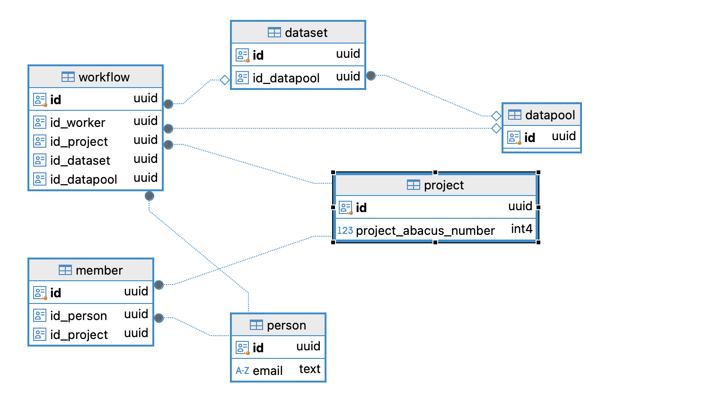

# **Database/SQL for researcher with R knowledge**

## Postgres/PostGIS at the Vogelwarte

---

## Overview
- Database overview
- RDB/SQL core principles
- Tools and connections
- **How to's** with R
- Practicle examples with the red kite

## Goal
- you can access the Postgres server dbspatialdata_projects in different ways
- you can create tables with R/Dbeaver (SQL)
- you can load and query data R/Dbeaver (SQL)
- you know the most important things for relations

---
## Type of Databases (overview)

---
## Type of Databases (structured)

#### Missing
- Vector databases (AI)

---

#### RDB/SQL Core principles (Thx - ChatGPT)

1. Tabular Data Representation
2. Relationships Between Tables / Databases
3. Data Integrity
4. Schema and Data Types
5. SQL Support
6. ACID Compliance
7. Scalability
8. Query Optimization
9.  Security
10. Backup and Recovery
11. Portability

---

### 1. Tabular Data Representation
- Data is organized into tables (relations), consisting of rows (records/tuples) and columns (fields/attributes).
- Each table represents an entity (e.g., customers, products).

---

### 2. Relationships Between Tables
- Tables can be related to each other using foreign keys, enabling the representation of complex relationships.
- Example: An orders table can reference a customers table using a customer_id foreign key.

---

### 3. Data Integrity
- Relational databases enforce data integrity through several constraints:

- Primary Key: Ensures each row in a table is unique.
- Foreign Key: Enforces relationships between tables and maintains referential integrity.
- Unique Constraint: Ensures all values in a column are distinct.
- Not Null Constraint: Prevents null (empty) values in a column.
- Check Constraint: Validates data based on specific conditions.
---

### 4. Schema and Data Types
- Each table has a defined schema specifying the structure and data types of columns.
- Example: id INTEGER, name VARCHAR(100), date_of_birth DATE.
- Ensures consistent and validated data storage.

---

### 5. SQL Support
- Relational databases use Structured Query Language (SQL) for querying, inserting, updating, and deleting data.
- Example: SELECT * FROM users WHERE age > 30;

---
### 6. ACID Compliance
ACID properties ensure reliable and consistent transactions:

- **Atomicity:** Transactions are all-or-nothing; if one part fails, the entire transaction is rolled back.
- **Consistency:** Transactions move the database from one valid state to another.
- **Isolation:** Transactions are executed independently of each other.
- **Durability:** Once a transaction is committed, it is permanently recorded, even in the event of a crash.

---

### 7. Scalability
- Relational databases are designed to handle large datasets and can scale vertically (better hardware) or horizontally (sharding/replication).

---
### 8. Query Optimization
- Built-in query planners optimize SQL queries to improve performance.
- Indexes can be created to speed up data retrieval.

---

### 9. Security
- Support for user authentication, role-based access control, and permissions to restrict data access.
- Example: Only specific users can read or write certain tables.

---

### 10.  Backup and Recovery
- Features for automated or manual backups and recovery to prevent data loss.

---

### 11.  Portability
- Relational databases are platform-independent, allowing data and schemas to be migrated between systems with minimal changes.

---

## Database @ Vogelwarte

**DBSPatialdata** has our core data for the birds in different schema
DB-Name is **research**

### Schema

- `monitoring` - research
- `conservation` - name is omen
- `species` 
- `synthese` - if you looking for information$
- `id` - data from ornitho.ch
- `codes` - ages, atlascodes, sexes, ...

---

### SQL

#### Relations 1

- unique key (id's) and foreign key
- Joins (left, inner, outer)
- similar you know `INDEX` or `VLOOKUP` in Excel
- do you know `d(b)yplr` - ...joins?

---
#### Data Integrity 

- on delete instruction if you build the relation 
`FOREIGN KEY (id_person) REFERENCES member(id_person) ON DELETE CASCADE`
  - `CASCADE` is useful for parent-child relationships where child records should be deleted when the parent is removed
  - `SET DEFAULT` allows a custom default value to signify an orphaned relationship
  - `SET NULL` is helpful when retaining child records but indicating the parent is gone.
  - `RESTRICT` ensure data integrity by preventing deletions if a relationship exists.

---

## SQL Statements
- **SQL DDL** - `Data Definition Language`
- Queries
- [Cheatsheet](https://www.sqltutorial.org/wp-content/uploads/2016/04/SQL-cheat-sheet.pdf)

---

## Tools

- [DBeaver](https://dbeaver.io)
- [PGAdmin](https://www.pgadmin.org)
- Microsoft Excel, Access
- [QGIS]()
- R/RStudio
- any programming languages

---

## Connections
- **DBeaver** (over JDBC)
- **RPostgres** (C++-Implementation)
- **ODBC** - open "ODBC Data Source (32-bit)" for Vogelwarte DB's
- psql (Postgres command line client)
- python: psycopg

## DB Connection on Server

- Host: dbspatialdata_projects
- Database: playground
- User: sql_brainhuddle
- Password: VoWa20241119

___

## **How to's** with R

- Explain RProject with renv, .Renviron and multiple files
- Connect DB
- *Create DB* 
- Create Schema 
- Create Table
  - default fields id, tm_created, *tm_modified*, ....
- Load Data
- Indexes (Unique)

---

## Further topics for Brain Huddle's

- Spatial Data in SQL [PostGIS](https://postgis.net)
- Advanced DB Stuff (Views, Materiallized Views, Functions, Triggers, ... )
- Docker - the easy life
- Github/Gitlab - Version Control
- CI/CD - Continuous Integration/Continuous Delivery
- Ollama - AI on local machine